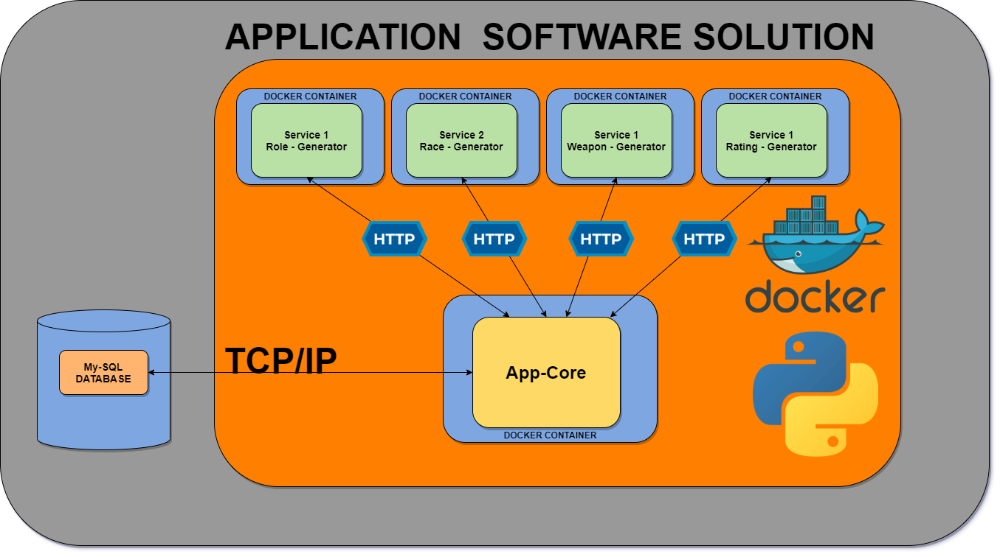

# dungeonsanddragonsgen
A dungeon and dragons character generator , built using a microservice structure

## Contents
* [Brief](#brief)
   * [Additional Requirements](#additional-requirements)
   * [My Approach](#my-approach)
* [Architecture](#architecture)
   * [Application Design](#application-design)
   * [Database Structure](#database-structure)
   * [CI/CD Pipeline](#ci-pipeline)
* [Project Tracking](#project-tracking)
* [Risk Assessment](#risk-assessment)
* [Testing](#testing)
* [Front-End Design](#front-end-design)
* [Known Issues](#known-issues)
* [Future Improvements](#future-improvements)
* [Authors](#authors)

# Follow the Project on this Kanban Board
https://trello.com/b/FFxPq00X/dungeonsanddragonsgen

## Breif 

### Additional Requirements

### My Approach

## Architecture

### Application Design

### Database Structure

### CI/CD Pipeline

## Project Tracking

## Risk Assessment

## Testing

## Front-End Design

## Known Issues 

## Future Improvements

## Authors

