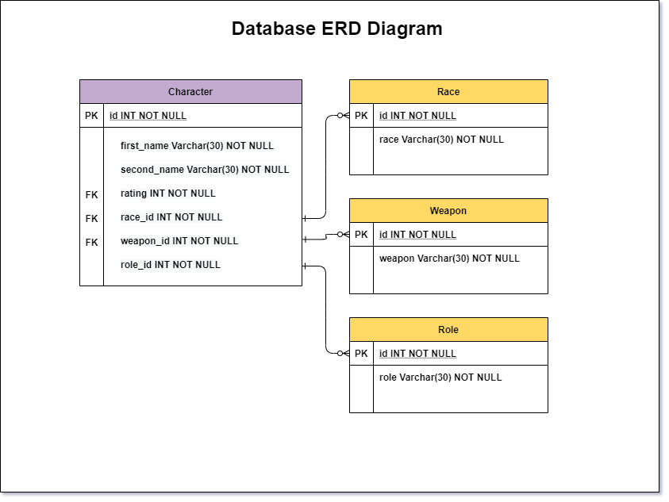
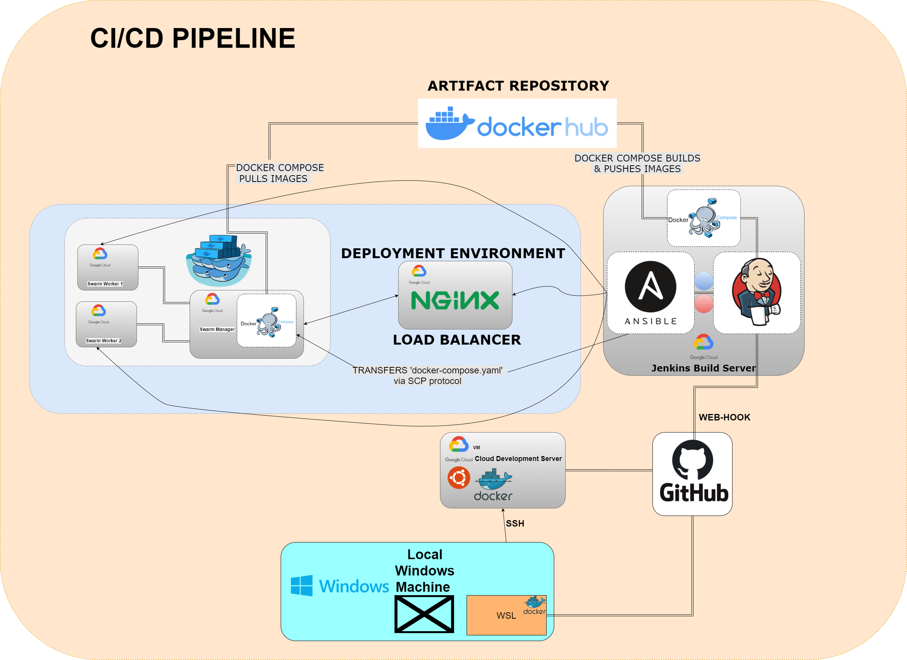
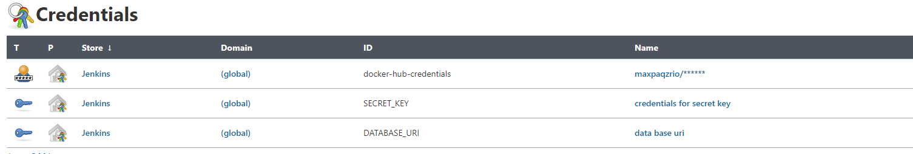
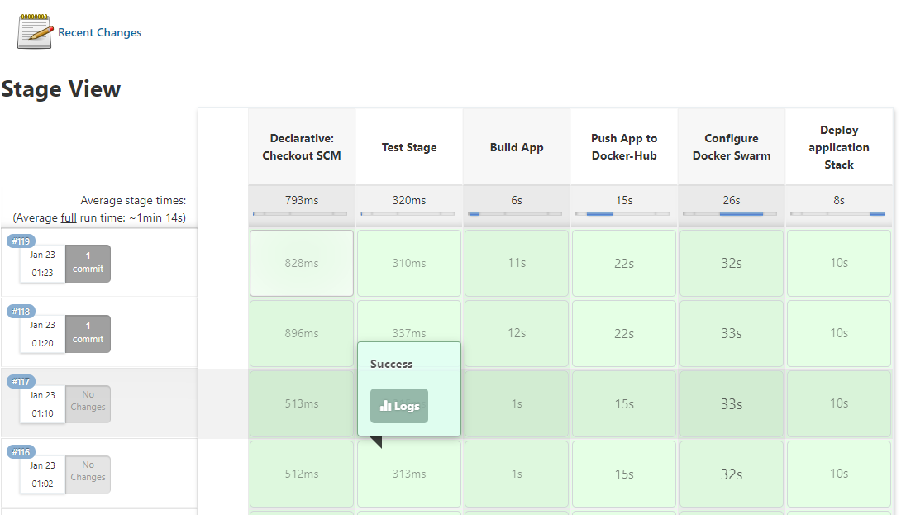
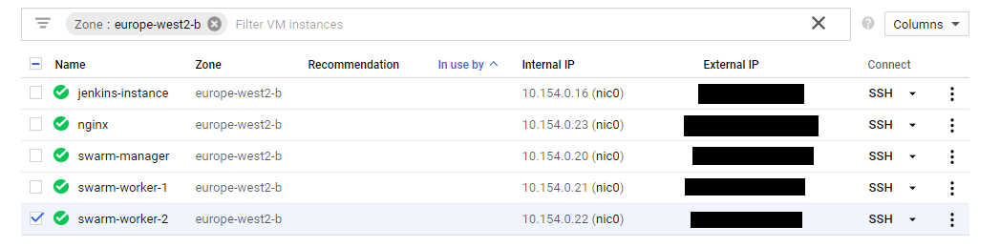
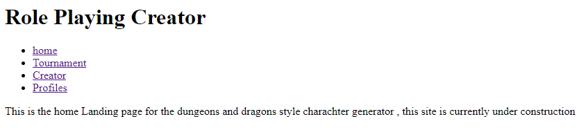
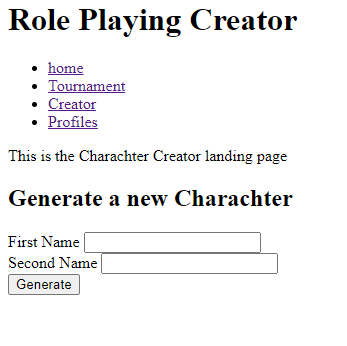
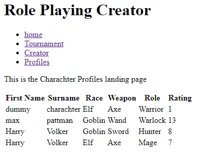

# dungeonsanddragonsgen
A dungeon and dragons character generator , built using a microservice structure

## Contents
* [Brief](#brief)
   * [Additional Requirements](#additional-requirements)
   * [My Approach](#my-approach)
* [Architecture](#architecture)
   * [Application Design](#application-design)
   * [Database Structure](#database-structure)
   * [CI/CD Pipeline](#ci-pipeline)
* [Project Tracking](#project-tracking)
* [Risk Assessment](#risk-assessment)
* [Testing](#testing)
* [Front-End Design](#front-end-design)
* [Known Issues](#known-issues)
* [Future Improvements](#future-improvements)
* [Authors](#authors)

## Brief 
To create a service-orientated architecture for an application, this application must be composed of at least 4 services that work together

* Service #1 The core service –  Renders Jinja2 templates to interact with the application, it will be responsible for communicating with the other 3 services, and finally for persisting some data in an SQL database.

* Service #2 + #3 - These will both generate a random “Object”

* Service #4 - This service will also create an “Object” however this “Object” must be based upon the results of service #2 + #3 using some pre-defined rules.

For services #2, #3 and #4 you need to create 2 different implementations, must be able to demonstrate swapping these implementations out for each other seamlessly, without disrupting the user experience.

### Additional Requirements
* An Asana board (or equivalent Kanban board tech) with full expansion on tasks needed to complete the project.
    * **Technology used : Trello**

* An Application fully integrated using the Feature-Branch model into a Version Control System which will subsequently be built through a CI server and deployed to a cloud-based virtual machine.
    * **Technology used : GIT**

* If a change is made to a code base, then Webhooks should be used so that Jenkins recreates and redeploys the changed application
    *   **Technology used : Githubs integrated webhooks settings** 

* The project must follow the Service-oriented architecture that has been asked for.
    *   **Approach used : 4 services including an application core were used** 

* The project must be deployed using containerisation and an orchestration tool.
    * **Container tool used : Docker**

    * **Container - orchestration tools used :**
        * **Docker-Compose**  
        * **Docker-Swarm** 
        * **Docker-Stack**

* As part of the project, you need to create an Ansible Playbook that will provision the environment that your application needs to run.
    * **Technology used : Ansible**

* The project must make use of a reverse proxy to make your application accessible to the user.
     * **Technology used : NGINX**

### Deliverable 

* The final deliverable for this project is a completed CI Pipeline with full documentation around the utilisation of supporting tools.
* The CI Pipeline needs to be able to successfully deploy the application you have created as per the requirements.

### My Approach

My ideal approach would have been to have the CI/CD system in place at least end to end in some working form. As projects develop there are always going to be changes to how the pipeline functions, this is inevitable as applications change over time. However having end to end function from development to delivery at the beginning of development , reduces the time to market for the application.
Due to time constraints and not having been taught the entirety of the material at the point of inception of the project . It was neccessary to parallelize the development of the application and the CI/CD pipeline.
Shortly after the CI/CD material was comprehended , I was able to focus on the CI/CD pipeline. Once the Infrastructure was complete, development on the application became much more streamlined in terms of effectivly dealing with errors and debugging.   

## Architecture

### Application Design

The application itself is very simple . The App-core is responsible for requesting information from the services . The generation of a charachter happens when the app-core requests nformation back from services #1 #2 & #3 .In this case each return a random number between 0-5 . each of these numbers corresponds to either a race , role or a weapon respectivly within the database. this then triggers the app-core to send these numbers as a json package to service #4 , service 4 then simply adds each number together . This is then returned to the app-core as a rating for the charachter. this is then added to the database.  

### Database Structure

### CI/CD Pipeline

### Local host (Windows sub system for linux {WSL})

I made the decision early on to preference developing the application using WSL on my local host. My IDE of choice for this project was **VS-CODE**

Typically when developing on cloud servers i have found it frustrating being unable to use tools such as code-completion and linting to reduce my development time.
Using WSL i am able to create a coding enviroment that is more efficient and consistent (for me) to use.     

### Cloud Development Server

After pushing to Github i would ssh into my cloud development server and pull the codebase from the github repository 
It was still essential to test the application, the system enviroments & scripts etc on a GCP cloud server. 

### Github
Git hub was my repository of choice . Webhooks settings can be set to interact with the jenkins build server. when code is pushed to the repository it sends a notification to the jenkins server   

### Jenkins 
Jenkins is an open source build server and CI/CD pipeline tool. in this project jenkins is set up to connect to github via a webhook. when jenkins receives the notification it pulls the repository to its server.

*environment credentials* : Jenkins allows us to set credentials that we want to keep secret for security reasons such as our SECRET_KEY and our DATABASE_URI

*Jenkinsfiles*            : Allow us to write our infrastructure pipelines as code by defining the stages of the pipeline and the steps taken in each stage. in this pipeline docker-compose is used to build the   application images and push them to the artifact repository , in this case Docker Hub

### Ansible 

In this application ansible is installed on the jenkins server and is used for our applications deployment, with jenkins as the user of Ansible , we are able to use Ansible to provision our deployment servers and deploy our application using Docker Stack.     

###### NGINX

Ansible is used to provision and deploy NGINX on a server to act as a load balancer for our application , Load balancers are typically used to increase user capacity and reliability of applications.

###### Swarm
Anisbile is used to provision our application servers with docker, docker-compose ,docker-swarn and docker-stack . Using the SCP transfer protocol, Ansible transfers the projects docker-compose.yaml file to the server that we have designated as our Swarm manager . Its from here we can call docker-stack to deploy our application using our docker-compose.yaml file. which in turn is able to pull the collection of our application images to the Swarm manager and deploy our application 

## Project Tracking
LINK TO KANBAN BOARD : https://trello.com/b/FFxPq00X/dungeonsanddragonsgen

## Risk Assessment

## Testing

## Front-End Design

* The Home Page 

 

* The Charachter generator

## Known Issues 

## Future Improvements

## Authors

